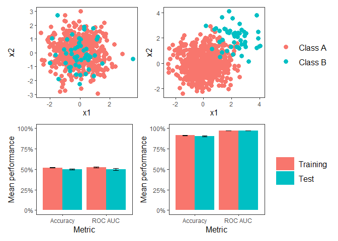

``` r
library(tidyverse)
library(tidymodels)
library(themis)
library(patchwork)
library(jtools)

theme_set(theme_apa())

class_data <- function(x1_bar, x2_bar, n){
    tibble(x1_bar = x1_bar,
           x2_bar = x2_bar,
           class = factor(c(0, 1))) %>%
        mutate(x1 = map(x1_bar, rnorm, n = n, sd = 1)) %>%
        mutate(x2 = map(x2_bar, rnorm, n = n, sd = 1)) %>%
        unnest(cols = c(x1, x2)) %>%
        select(x1, x2, class) %>%
        head(n * 1.1)
}

simulate <- function(x1_bar, x2_bar, n, sim_num){
    data <- class_data(x1_bar, x2_bar, n)

    split <- initial_split(data, prop = 0.8, strata = class)
    train <- training(split)
    test <- testing(split)

    folds <- vfold_cv(train)

    rec <- train %>%
        recipe(class ~ .) %>%
        themis::step_downsample(class)

    rf_spec <- rand_forest(mode = "classification",
                           trees = 500,
                           mtry = tune(),
                           min_n = tune()) %>%
        set_engine("ranger")

    results <- tune_grid(rf_spec, rec, folds, grid = 10)

    best_params <- select_best(results, metric = "accuracy")

    rf_final <- finalize_model(
        rf_spec,
        best_params
    )

    training_results <- results %>%
        collect_metrics() %>%
        group_by(.metric) %>%
        slice_max(mean, n = 1) %>%
        slice_head(n = 1) %>%
        ungroup() %>%
        transmute(set = "training",
                  metric = .metric,
                  mean)

    test_results <- last_fit(rf_final, rec, split) %>%
        collect_metrics() %>%
        transmute(set = "test",
                  metric = .metric,
                  mean = .estimate)
    
    return(
        bind_rows(training_results, test_results) %>%
            mutate(sim_num = sim_num)
    )
}

plot_data <- function(x1_bar, x2_bar, n){
    class_data(x1_bar = x1_bar, x2_bar = x2_bar, n = n) %>%
        mutate(class = ifelse(class == 0, "Class A", "Class B")) %>%
        ggplot(aes(x1, x2, color = class)) +
        geom_point(size = 3)
}
```

``` r
d0 <- plot_data(x1_bar = c(0, 0), x2_bar = c(0, 0), n = 500)
d2 <- plot_data(x1_bar = c(0, 2), x2_bar = c(0, 2), n = 500)

results0 <- map_df(1:100, simulate, x1_bar = c(0, 0), x2_bar = c(0, 0), n = 500)
results2 <- map_df(1:100, simulate, x1_bar = c(0, 2), x2_bar = c(0, 2), n = 500)

plot_results <- function(results){
    results %>%
        group_by(set, metric) %>%
        summarize(avg = mean(mean),

                  sem = sd(mean) / sqrt(max(sim_num))) %>%
        ungroup() %>%
        mutate(set = str_to_title(set)) %>%
        mutate(set = fct_relevel(set, "Training")) %>%
        mutate(metric = str_to_title(metric)) %>%
        mutate(metric = ifelse(metric == "Roc_auc", "ROC AUC", metric)) %>%
        ggplot(aes(metric, avg, fill = set)) +
        geom_col(position = "dodge") +
        geom_errorbar(aes(ymin = avg - sem, ymax = avg + sem), position=position_dodge(width=0.9), width = 0.25) +
        scale_y_continuous(labels = scales::percent_format(), limits = c(0, 1)) +
        labs(x = "Metric",
             y = "Mean performance",
             fill = NULL)
}

r0 <- plot_results(results0)
r2 <- plot_results(results2)

(d0 + d2 + plot_layout(guides = "collect")) /
    (r0 + r2 + plot_layout(guides = "collect"))
```



<br /> <br /> <br /> <br /> <br />
